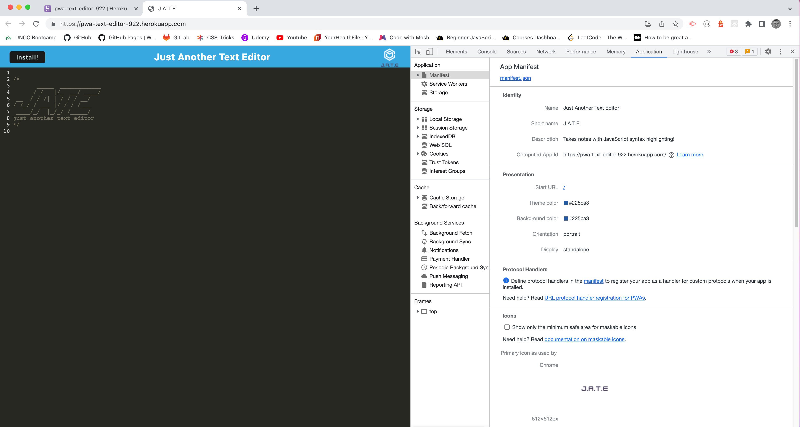
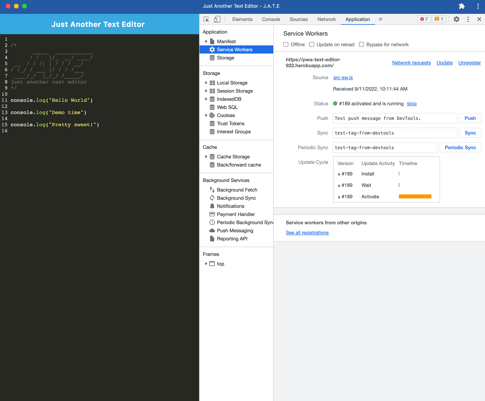
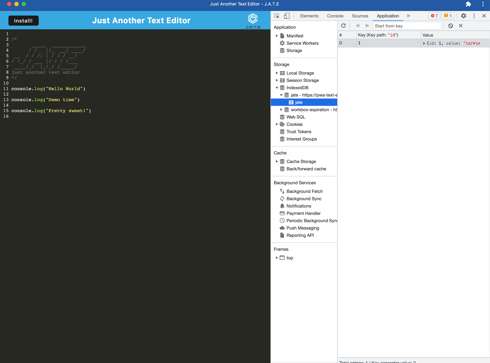

# PWA Text Editor

## Description

A text editor that runs in the browser. This app is a single-page application that meets the PWA criteria. Additionally, it features a number of data persistence techniques that serve as redundancies in case one of the options is not supported by the browser. The application will also function offline.

## Demo and Screenshots of PWA Text Editor

The following animation demonstrates the application functionality:

The following image shows the application's `manifest.json` file:

The following image shows the application's registered service worker:

The following image shows the application's IndexedDB storage:

## Technology Used

  
   

## Heroku App for PWA Text Editor

-   [PWA Text Editor App](https://pwa-text-editor-922.herokuapp.com/)

## GitHub repository for challenge 19

-   [Github PWA Text Editor Repo](https://github.com/joliver521/PWA-Text-Editor)
